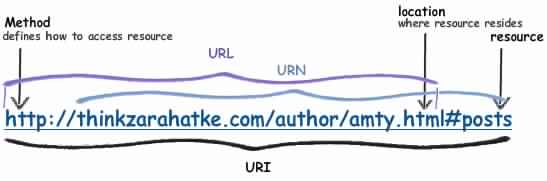

 <h1>Application REST</h1> 

# Architecture Rest/RestFull
Une application rest ou (RestFull) est une architecture qui permet de construire une application Web.  
C’est un style d’architecture créé par Roy Fielding en 2000 (chapitre 5 de sa thèse doctorat).  
Il s’agit d’un ensemble de conventions et de bonnes pratiques.  

# Contraintes
* Le client et le serveur sont indépendants
* Aucune variable de session ou état volatile ne doit être enregistré côté serveur.
* le serveur indique au client la possibilité de mise en cache de l’information. 
Ceci évite des requêtes inutiles.
* une interface uniforme.
* Une hiérarchie par couche : les ressources sont individuelles
* (Facultatif) Exécution de scripts côté client obtenus par le serveur.
    * libère le serveur
    * plus grande importance du client
    * il faut rester prudent sur cette contrainte. Le coeur du métier doit être centralisé sur le serveur.

# Règles à suivre:
* L’ URI est l’identifiant des ressources (Uniform Resource Identifier)

* Les verbes HTTP identifient les opérations
    *CRUD : Create, Read, Update, Delete
    * => POST, GET, PUT, DELETE
* Les réponses HTTP représentent les ressources
    * Les ressources sont sur le serveur (fichiers, bases de données)
    * la réponse est une représentation des ressources
    * On définit le format de cette représentation. C’est le client qui définit le format via l’entête “Accept”
        * HTML => Accept: text/html
        * XML => Accept: application/xml
        * JSON => Accept: application/json
        * CSV => => Accept: application/csv
        * ...
* les liens comme relation entre ressources
    * HATEOAS (Hypermedia As The Engine Of Application State)
    * liens hypermedias entre les ressources
    * Pour éviter des réponses HTTP trop verbeuses
    * Envoyer une réponse explicite au client

* Un paramètre comme jeton d’authentification (token)
    * demande d’authentification
    * accès aux ressources.

# URI

# Documentation
[la-theorie-rest-restful-et-hateoas](https://zestedesavoir.com/tutoriels/299/la-theorie-rest-restful-et-hateoas/)  
[hateoas](http://putaindecode.io/fr/articles/api/hateoas/)
[symfony2 et rest](http://afsy.fr/avent/2013/06-best-practices-pour-vos-apis-rest-http-avec-symfony2)
