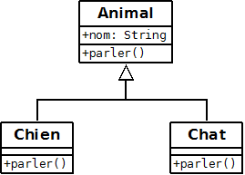
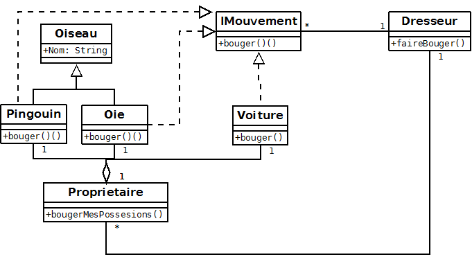

<center> <h1>Java - Programmation Orientée Objet avancé</h1> </center>

# Rappel
Une classe définie une entité. Une classe contient des objets (instances).  
Pour créer un objet, on utilise le mot clef `new` suivi du nom de la classe.  
Ceci réserve une place en mémoire pour stocker les propriétés de l'objet, 
et renvoie une adresse (pointeur) référençant la zone mémoire.

# L'héritage
Une classe est décrite par des propriétés et des méthodes. Chaque classe a ses spécificités.  
Le but de l'héritage est de regrouper les propriétés et les méthodes communes dans une nouvelle classe (la classe parente) puis d'hériter de cette classe.  
L'héritage est toujours additif ; il est impossible d'hériter d'une classe et de recevoir moins que ce que possède la classe parent.  
On parle aussi de généralisation.   
Mot clef : **extends**  
En Java, une classe ne peut hériter que d'une seule classe (contrairement au C++).  
L'avantage est une centralisation du code, gain en ligne de code et en maintenance.  
L'inconvénient est la lisibilité du code qui se complexifie.  
Note : Toute classe dérive de la classe Object.  

``` java
public class Animal {
	private String race;
	protected String nom;
	
	public Animal(String race, String nom) {
		this.race = race;
		this.nom = nom;
	}
	
	protected String sAnnoncer() {
		return("je suis le " + this.race + " " + this.nom);
	}

}
``` 
``` Java
public class Chien extends Animal {

	public Chien(String nom) {
		super("chien", nom); //appel du constructeur parent
	}
    
	public void parler() {
		System.out.println("C'est le chien " + this.nom + " qui parle :"); //appel de la propriété parente
		System.out.println(this.sAnnoncer()); //appel de la méthode du parent
	}
	
}
``` 
``` Java
public class Appel {
	private static Chien rex;

	public static void main(String[] args) {
		rex	 = new Chien("Rex");
		rex.parler();
	}
}
```

# Encapsulation
L'idée d'encapsulation est apparue dès de début de la POO.  
Le but est de protéger l'objet en ne montrant que les méthodes de manipulation.  
On cache les propriétés et les méthodes internes au fonctionnement de l'objet.  
On rend visible uniquement les méthodes qui doivent être vues de l'extérieur.  
On parle de **visibilité**.  
C'est devenu une norme de développement en POO.  
Les 3 mots clefs que l'on retrouve dans un langage objet sont `private`, `protected`, `public`.  
* `private` : visibilité restreinte à la classe
* `public` : visibilité de tous
* `protected` : visibilité restreinte à la classe et aux descendants.  

Note : en java, si on n'indique pas de visibilité cette dernière est limitée au package (Friendly).   

Par défaut en développement, mettez tout en private (sauf accesseur) et 
agrandissez progressivement la portée des méthodes en fonction des besoins.  
Certains développeurs préconisent l'utilisation systématique du protected à la place du private.  
Je pense que le protected systématique ne peut être mis que pour les propriétés si vous savez que la classe sera dérivée.
Ceci évite l'utilisation intempestive des accesseurs.  
**Dans tous les cas, ne mettez pas les propriétés de l'objet en `public`.**

Quelques avantages de l'encapsulation :
* Un objet peut être très complexe, l'encapsulation simplifie sa visibilité extérieure et donc son utilisation.
* Le développeur reste maître de la classe qu'il a écrite. Ce qui est en private est modifiable sans interférence.
* L'encapsulation est un atout pour la rétro-compatibilité.

L'encapsulation ne concerne pas les propriétés et méthodes statiques.   

```java
package fr.laposte.encapsulation;

public class Personne {
	protected String nom;
	protected String prenom;
	protected int age;
	protected boolean enCours;
	/**
	 * @param nom
	 * @param prenom
	 * @param age
	 * @param enCours
	 */
	public Personne(String nom, String prenom, int age, boolean enCours) {
		super();
		this.nom = nom;
		this.prenom = prenom;
		this.age = age;
		this.enCours = enCours;
	}
	public String getNom() {
		return nom;
	}
	public void setNom(String nom) {
		this.nom = nom;
	}
	public String getPrenom() {
		return prenom;
	}
	public void setPrenom(String prenom) {
		this.prenom = prenom;
	}
	public int getAge() {
		return age;
	}
	public void setAge(int age) {
		this.age = age;
	}
	public boolean isEnCours() {
		return enCours;
	}
	public void setEnCours(boolean enCours) {
		this.enCours = enCours;
	}
}
``` 
``` Java
public class Client extends Personne {
	
	private int numeroClient;

	public Client(String nom, String prenom, int age, boolean enCours) {
		super(nom, prenom, age, enCours);

	}

	@Override
	public String toString() {
		return "Client [numeroClient=" + numeroClient + ", nom=" + nom + ", prenom=" + prenom + ", age=" + age
				+ ", enCours=" + enCours + "]";
	}

	public int getNumeroClient() {
		return numeroClient;
	}

	public void setNumeroClient(int numeroClient) {
		this.numeroClient = numeroClient;
	}

	
}
``` 
``` Java
public class GestionClient {

	public GestionClient() {
		// TODO Auto-generated constructor stub
	}
	public static void main(String[] args) {
		Client client = new Client("Dupont", "Jean", 52, true);
		client.setNumeroClient(56842);
		System.out.println(client.toString());
	}
}
```

# L'abstraction
L'abstraction est le fait de décrite quelque chose sans le définir par du contenu.  
Elle n'a d'utilité que si cette classe a des enfants.  
L'abstraction indique à la classe enfant ce qu'elle doit faire.  
Mais elle ne dit pas comment.  

## La classe abstraite
Une classe abstraite (abstract) est une classe qui ne peut être instanciée.  
C'est une classe qui est étendue (elle est parente).  

## La méthode abstraite
Une méthode abstraite appartient forcément à une classe abstraite.  
Cette méthode est vide. Elle ne contient que la signature.  
Cette  méthode abstraite devra être implémentée dans la classe enfant.

## Exemple
``` java
public abstract class Animal {
	
	//propriétés de l'objet
	protected String nom; 
	
	//constructeur
	public Animal(String nom) {
		super(); //appel du constructeur parent
		this.nom = nom;
	}
	
	//une methode de l'objet
	protected String formulerMonNom() {
		return "Je m'appelle " + this.nom; //appel de la propriété nom
	}

	//une methode abstraite
	public abstract void parler();
}
``` 
``` Java
public class Chien extends Animal {

	public Chien(String nom) {
		super(nom); //appel du constructeur parent
	}

	@Override
	public void parler() {
		System.out.println("je suis le chien " + this.nom + ", et je dis WOUF WOUF");
	}
	
}
``` 
``` Java
public class AppelAnimal {
	private static Animal personne, rex;

	private static void faireParler(Animal animal) {
		animal.parler();
	}
	
	public static void main(String[] args) {
		
		/* impossible car classe abstraite
		personne = new Animal("Sans nom");
		faireParler(personne); //Je suis un animal
		*/
		
		rex	 = new Chien("Rex");
		faireParler(rex); //je suis le chien Rex, et je dis WOUF WOUF
	}

}
```

# Final
Le mot `final` sert à protéger son code. Il empêche toute modification.  

## La variable finale
Une variable `final` est une constante.  
Un objet final est un pointeur qui désigne une zone mémoire fixe. Le contenu de l'objet peut changer, mais pas son adresse.  

## La classe finale
Une classe `final` est une classe qui ne peut être étendue (pas d'héritage).  
On interdit à tout développeur d'hériter de cette classe.  

## La méthode finale
Une méthode `final` ne peut pas être redéfinie dans une classe fille.  
On hérite de la classe mais on interdit la redéfinition de la méthode (voir l'override).

## Exemple
```java
public final class Chien extends Animal {
	
	private final int nombreCollier;

	public Chien(String nom) {
		super("chien", nom); 
		this.nombreCollier = 0;
	}
    
	public final void parler() {
		System.out.println("C'est le chien " + this.nom + " qui parle :"); //appel de la propriété parente
		System.out.println(this.sAnnoncer()); //appel de la méthode du parent
	}
	
}
```

# Interface
Une interface signifie à une classe comment se présenter, mais pas comment se comporter.  
Explication : lorsque qu'une classe implémente une interface, cette classe doit définir les mêmes méthodes 
que celles de l'interface.  
On pourrait voir cela comme une contrainte, mais c'est le contraire qui se produit avec le polymorphisme (cf § ci-dessous).  
Quand vous aurez bien compris ce concept d'interface, vous l'utiliserez énormément dans votre code, 
car il simplifie le refactoring.  
Note : les bibliothèques fournies avec la JVM sont toutes basées sur les interfaces.  
Pour indiquer à une classe qu'elle implémente une interface on utilise le mot clef `implements`.  

Une interface est une classe abstraite qui ne contient que des méthodes abstraites.  
Elle peut contenir des constantes.  
Une interface peut hériter d'une autre interface. Contrairement à un héritage, une classe peut implémenter plusieurs interfaces.  
Le mot clef pour déclarer une interface est `Interface`.  
```java
public interface IInstrumentMusique {
	enum Note{DO, RE, MI, FA, SOL, LA, SI}; // static & final
	void jouer(); // automatiquement public
	void ajuster();
	void faireUneNote(Note note);
}
``` 
``` Java
public class Violon implements IInstrumentMusique{
	
	@Override
	public void jouer() {
		System.out.println("Violon.jouer");
		for (Note note : Note.values()) {
			faireUneNote(note);
		}
		
	}

	@Override
	public void ajuster() {
		System.out.println("Violon.ajuster");
		faireUneNote(Note.RE);
		
	}

	@Override
	public void faireUneNote(Note note) {
		System.out.println(note);
	}

}
``` 
``` Java
public class Musicien {

	public static void main(String[] args) {
		Violon violon = new Violon();
		violon.jouer();
		violon.ajuster();
	}

}
```

# toString
C'est la méthode qu'on appelle dès que l'on veut garder une trace écrite de l'objet, en particulier lors du debuggage.  
Cette méthode est héritée de la classe Object.  
Par défaut, elle affiche le nom de la classe et son adresse.  
Il est plus exploitable d'afficher les propriétés de l'objet. Pour cela il faut redéfinir la méthode dans la classe.  
```java
	@Override
	public String toString() {
		return "Client [numeroClient=" + numeroClient + ", nom=" + nom + ", prenom=" + prenom + ", age=" + age
				+ ", enCours=" + enCours + "]";
	}
```

# Clonage d'objet
Le clonage est très peu utilisé en Java, voir interdit. Mais dans certains cas il peut être bien utile de dupliquer un objet.  
En objet une variable objet est un pointeur. Imaginons le code suivant :  
``` Java
titi = new Oiseau();  
maitreCorbeau = titi;
```   
Dans ce cas, nous avons 2 adresses qui pointent sur la même zone mémoire, **et un seul objet !!!**.  
Pour copier l'objet, on faut dupliquer la zone mémoire en faisant un clonage. 
Pour cloner un objet, il faut implémenter l'interface `cloneable` et implémenter la méthode `clone` en dupliquant chaques champs.  
[par ici le tuto](http://ydisanto.developpez.com/tutoriels/java/cloneable/#LI)  
Une autre variante est de créer un nouvel objet en passant tous les attributs dans le constructeur.  

# Comparaison de 2 objets
La comparaison n'est simple pas en Java.  
Le comparateur `==` fonctionne avec les types primitifs. Si vous comparez 2 objets avec `==`, vous comparez les adresses et non le contenu.  
Vous voulez peut-être savoir si 2 objets sont équivalents, c'est à dire ont les mêmes valeurs d'attributs.  
Dans ce cas, il faut implémenter la méthode `equals`.  
Pour plus de détail [§97.2.2.3 du tuto](https://www.jmdoudoux.fr/java/dej/chap-techniques_java.htm#techniques_java-2).  

# Singleton
En POO, un singleton répond à la problématique de n'avoir qu'un seul et unique objet dans la classe.  

``` Java
public class MySingleton {
	private static MySingleton singleton = null;
    protected String name;
    
    public static MySingleton getInstance() {
        if(singleton == null) {
        	singleton = new MySingleton();  
        }
        return singleton;
    }
    
	public String getName() {
		return name;
	}
	public void setName(String name) {
		this.name = name;
	}
}
``` 
``` Java
public class AppelSingleton {
	static MySingleton single, single2;
	public static void main(String[] args) {

		single = MySingleton.getInstance();
		single.setName("Arthur");
		System.out.println(single.getName()); // Arthur

		single2 = MySingleton.getInstance();
		System.out.println(single2.getName()); // Arthur
    }
}
```   
# Polymorphisme
Petit rappel : 
* le polymorphisme traite de la capacité de l'objet à posséder plusieurs formes. 
* cette notion intervient les méthodes (et non sur les propriétés).
* une méthode possède une signature : un nom, un retour, des paramètres, et une visibilité

Il existe plusieurs façons de faire du polymorphisme :  
* par surcharge (overload)
* par redéfinition (override)
* par interface

# Surcharge 
La surcharge permet d'écrire plusieurs fois la même méthode avec le même nom. Elle s'écrit dans la même classe.    
Ce qui diffère est le nombre et le type d'arguments.  
On ré-écrit la méthode avec une signature différente.  
Elle permet à un objet d'avoir un comportement différent selon les paramètres passés.  

``` java
public class Oiseau {

	public Oiseau() {
	}

	public void voler() {
		this.voler("avec mes ailes");
	}
	
	public void voler(String complement) {
		System.out.println("je vole " + complement);
		
	}
	
	public void voler(int nombreCompagnon) {
		System.out.println("je décolle avec " + nombreCompagnon + " compagnons !!!!");
	}

}
``` 
``` Java
public class Appel {
    public static void main(String[] args) {
        Oiseau oiseau = new Oiseau();
        oiseau.voler("vite");
        oiseau.voler();
        oiseau.voler(3);
    }
}
```

## Redéfinition (override)
L'override est la réécriture de la méthode avec la même signature. 
Cette réécriture ne peut pas se faire dans la même classe.  
Elle est faisable dans la cas d'un héritage.  

Une classe parente possède une méthode.  
Nous redéfinissons la méthode avec la même signature dans une classe fille.  
Ce polymorphisme permet de spécialiser ou changer le comportement de la classe fille.  
Un bon IDE comme Eclipse indique que la méthode est en override : triangle vert.   
De plus il est conseillé de mettre l'annotation `@Override`.  

 

```Java
public class Animal {
	protected String nom;
	
	public Animal(String nom) {
		super(); //appel du constructeur parent Object
		this.nom = nom;
	}

	public void parler() {
		System.out.println("Je suis un animal");
	}

}
``` 
``` Java
public class Chien extends Animal {

	public Chien(String nom) {
		super(nom); //appel du constructeur parent
	}
    
	@Override
	public void parler() {
		System.out.println("je suis le chien " + this.nom + ", et je dis WOUF WOUF");
	}
	
}
``` 
``` Java
public class Chat extends Animal {

	public Chat(String nom) {
		super(nom); //appel du constructeur parent
	}

	@Override
	public void parler() {
		super.parler(); //appel de la methode du parent
		System.out.println("je suis le chat " + this.nom + ", et je dis MIAOU");
	}

}
``` 
``` Java
public class Appel {
	private static Animal personne, rex, felix;

	private static void faireParler(Animal animal) {
		animal.parler();
	}
	
	public static void main(String[] args) {
		personne = new Animal("Sans nom");
		rex	 = new Chien("Rex");
		felix = new Chat("Felix");
		
		faireParler(personne); //Je suis un animal
		faireParler(rex); //je suis le chien Rex, et je dis WOUF WOUF
		faireParler(felix); //Je suis un animal & je suis le chat Felix, et je dis MIAOU
	}

}
```

## Par interface
C'est une variante du polymorphisme par redéfinition (override).  
Ce polymorphisme est plus puissant car il n'est pas contraint par l'héritage. Par contre il est plus difficile à lire.  
Ce polymorphisme consiste à fournir une interface unique pour des objets appartenant à des classes différentes.  
Prenons l'exemple d'un dresseur d'oiseaux qui possède des pingouins et des oies. 
Ces 2 familles d'oiseaux n'ont pas la même faculté de mouvement.  
Il veut communiquer avec ces 2 familles par la même interface quelque soit la classe.  
Et mieux encore le dresseur est capable de communiquer avec une voiture qui n'a aucun point commun avec les oiseaux.  
  
 
``` Java
public interface IMouvement {
	
	public void bouger();

}
``` 
``` Java
public class Oiseau {
	protected String nom;

	public Oiseau(String nom) {
		this.nom = nom;
	}

}
``` 
``` Java
public class Oie extends Oiseau implements IMouvement{

	public Oie(String nom) {
		super(nom); //appel du constructeur parent
	}

	@Override
	public void bouger() {
		System.out.println("Je suis l'oie "+this.nom+" et je vole");
	}
	
}
``` 
``` Java
public class Pingouin extends Oiseau implements IMouvement{

	public Pingouin(String nom) {
		super(nom); //appel du constructeur parent
	}

	@Override
	public void bouger() {
		System.out.println("Je suis le pinguoin "+this.nom+" et je marche");
	}

}
``` 
``` Java
public class Voiture implements IMouvement{

	public Voiture() {
		super(); //appel du constructeur parent
	}

	@Override
	public void bouger() {
		System.out.println("Je suis une voiture et je roule");
	}
	
}
``` 
``` Java
public class Dresseur {

	public Dresseur() {
	}
	
	public void bouger(ArrayList<IMouvement> possesions) {
		for (IMouvement possesion : possesions) {
			possesion.bouger();
		}
	}
}
``` 
``` Java
public class Proprietaire {

	private Oie monOie;
	private Pingouin monPingouin;
	private Voiture maVoiture;
	private Dresseur monDresseur;
	
	public Proprietaire() {
		this.monOie = new Oie("Gertrude");
		this.monPingouin = new Pingouin("Jasper");
		this.maVoiture = new Voiture();
		this.monDresseur = new Dresseur();
	}
	
	public void bougerMesPossesions() {
		ArrayList<IMouvement> cEstAMoi = new ArrayList<IMouvement>();
		cEstAMoi.add(this.monPingouin);
		cEstAMoi.add(monOie);
		cEstAMoi.add(this.maVoiture);
		this.monDresseur.bouger(cEstAMoi);
	}
}
``` 
``` Java
public class PolymorphismeParInterface {

	public static void main(String[] args) {
		Proprietaire proprio = new Proprietaire();
		proprio.bougerMesPossesions();
	}

}
```